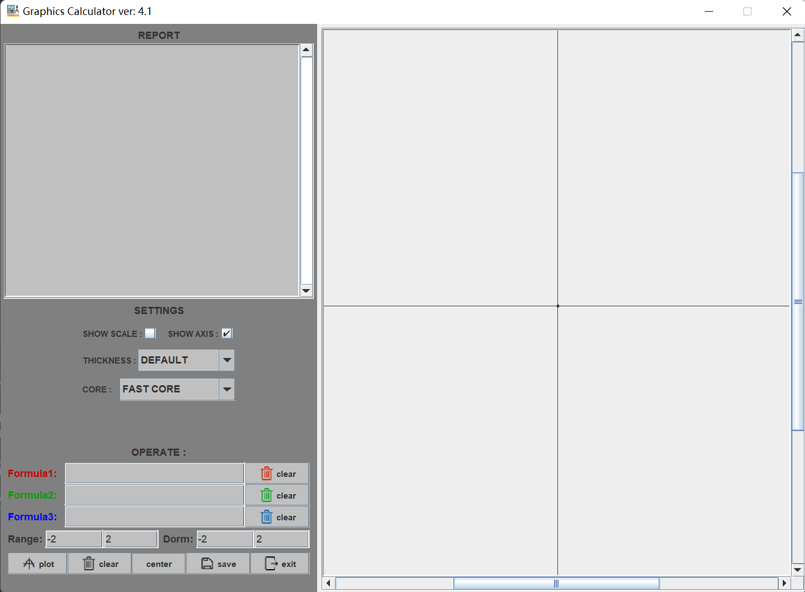
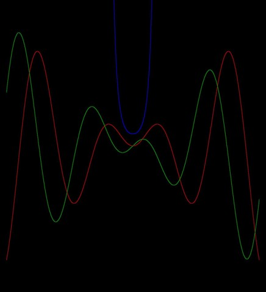

# Document

## Project structure

- `./src/Graphics_Calculator`: the main module written in java language with full feathur
- `./icon`: the image resources oof the application

## Futher document

- This project is the original version of my semster project during the first semster of my college, it was written in pure java with GUI interface in module `swing`.
- `CalculateModel.java` holds the core code, as it contains the code to calculate the exact position of each point on a fomula graph. I had no better idea how to show a continous graph from discrite points at that time, so I calculated each point of the graph pixel by pixel so the graph seems to be continous.
- `GraphPanel.java` holds the GUI code. I had no idea about `MVC` mode so I wrote every thing in one file without dividing each process from each other. This part has literally no readability.

## Demo to the function I've realized

- The main interface:

- The `report` session plays the role of a console, some information about the calculated functon will be demostrated here.
- The `setting` session is a panel that allows user to change the default settings of calculation, including the calculating core applied. The thickness of the line of the function, and whether to show the axis and scale or not.
- The `operate` session is the part that takes the input formula and perform some basic interaction with the user.
  1. `plot` takes the inputed formulas and show the calculated graph in the right empty session.
  2. `center` moves the view-point to the original point if the view-point is moved to some point other than the original point.
  3. `save` write the calculated graph to disk and generate an image.
- Finally, some images calculated by the calculator.

 
f1 : ((x*0.5+y*0.5)^500+(x*0.5-y*0.5)^500-4)*(x^2+y^2-1)=0 
f2 : ((x+y)^500+(x-y)^500-4)=0 
f3 : (x^500+y^500-4)*(x-y)*(x+y)=0 
 
f1 : x*sin(x)=y 
f2 : x*cos(x)=y 
f3 : e^(x^2)=y 

